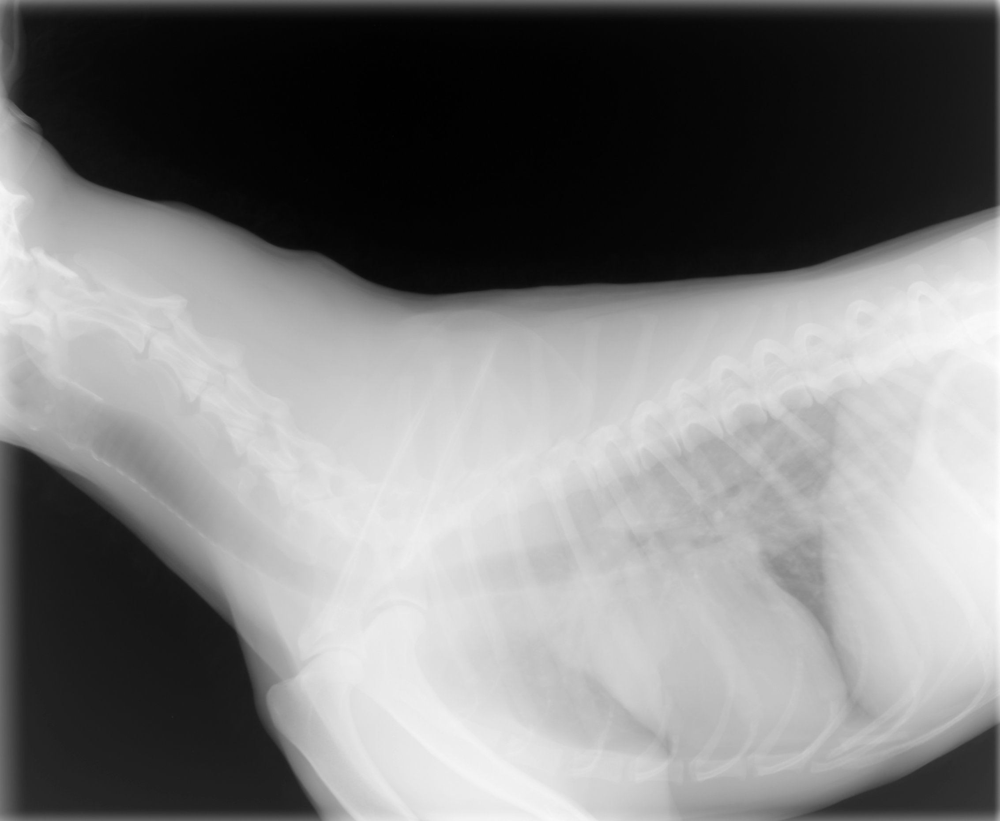
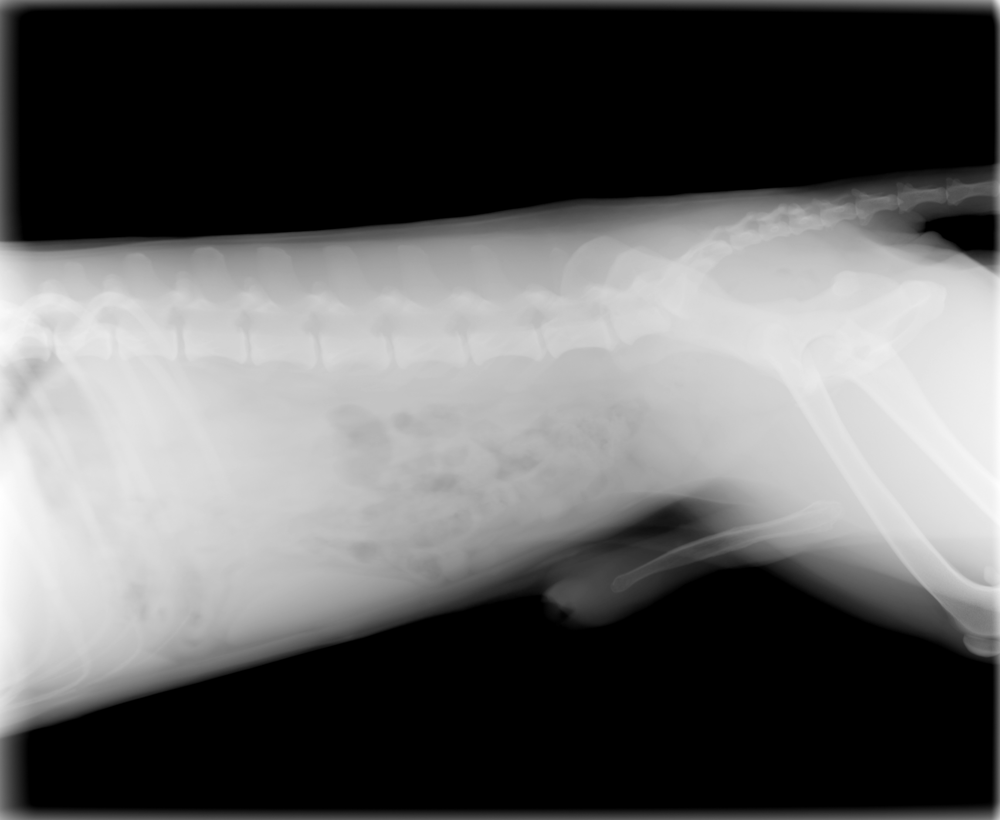
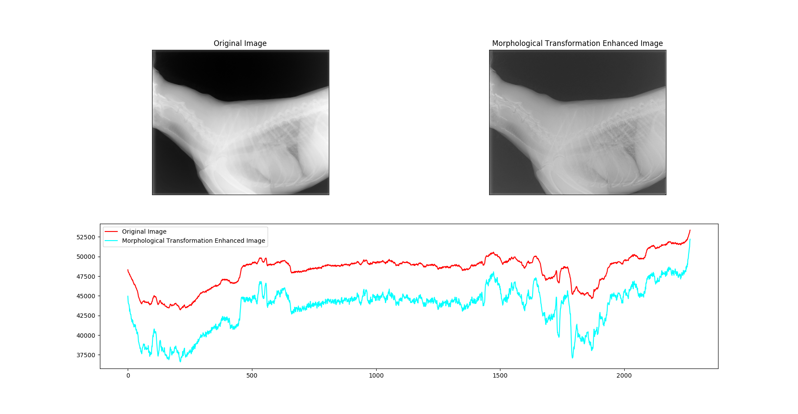
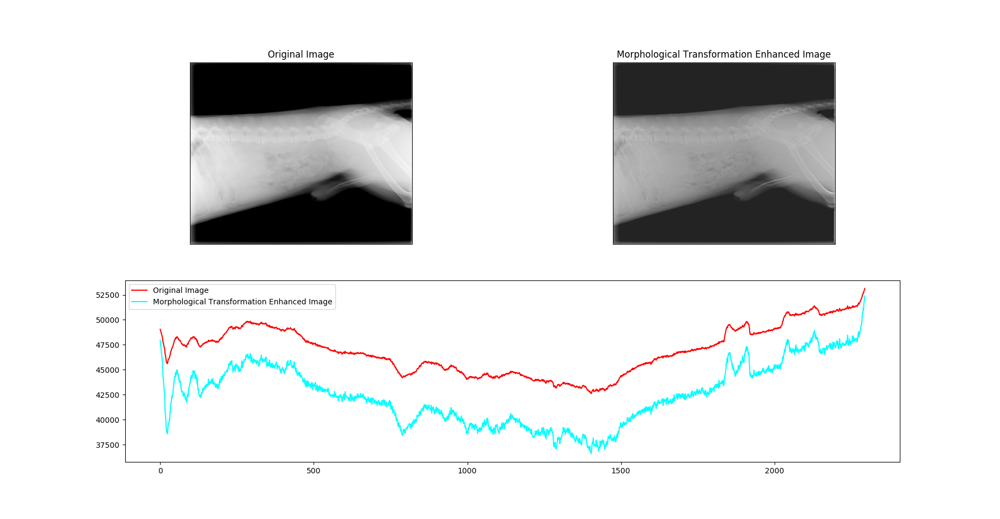

# Medical_image_enhancement_MT
This project is a demo of medical image enhancement method using Morphological Transformation method.

For details, please refer to the paper: [Medical Image Enhancement Using Morphological Transormation](http://file.scirp.org/pdf/JDAIP_2016020209450081.pdf).

In order to speed up the processing, I set the structural element size to be a constant value, which is different from the paper.

# Example of Original Images

# Example of Enhanced Imagess

# Contrast Enhancement Analyse

# For more
Contact Me: vxallset@outlook.com
